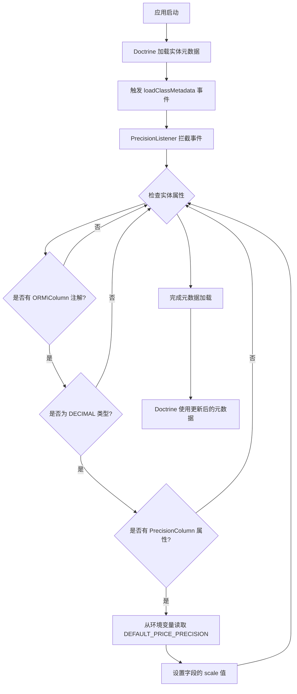
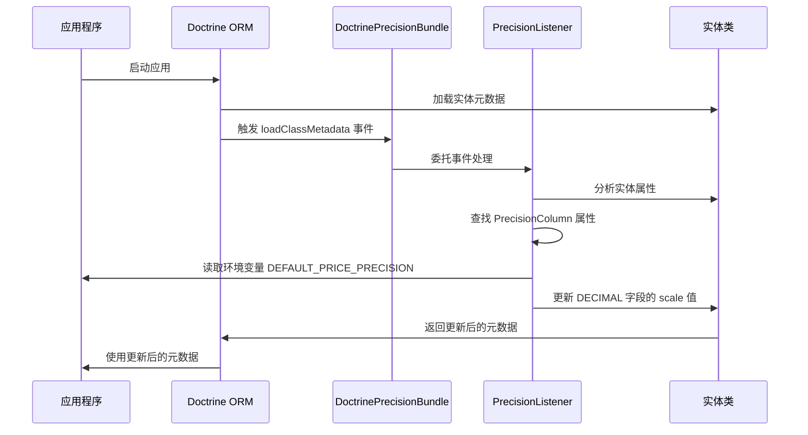

# Doctrine Precision Bundle 工作流程

本文档使用 Mermaid 图表展示 Doctrine Precision Bundle 的工作流程。

## 处理流程

```mermaid
graph TD
    A[应用启动] --> B[Doctrine 加载实体元数据]
    B --> C[触发 loadClassMetadata 事件]
    C --> D[PrecisionListener 拦截事件]
    D --> E{检查实体属性}
    E --> F{是否有 ORM\Column 注解?}
    F -->|否| E
    F -->|是| G{是否为 DECIMAL 类型?}
    G -->|否| E
    G -->|是| H{是否有 PrecisionColumn 属性?}
    H -->|否| E
    H -->|是| I[从环境变量读取 DEFAULT_PRICE_PRECISION]
    I --> J[设置字段的 scale 值]
    J --> E
    E --> K[完成元数据加载]
    K --> L[Doctrine 使用更新后的元数据]
```

## 组件交互

```mermaid
sequenceDiagram
    participant App as 应用程序
    participant Doctrine as Doctrine ORM
    participant Bundle as DoctrinePrecisionBundle
    participant Listener as PrecisionListener
    participant Entity as 实体类

    App->>Doctrine: 启动应用
    Doctrine->>Entity: 加载实体元数据
    Doctrine->>Bundle: 触发 loadClassMetadata 事件
    Bundle->>Listener: 委托事件处理
    Listener->>Entity: 分析实体属性
    Listener->>Listener: 查找 PrecisionColumn 属性
    Listener->>App: 读取环境变量 DEFAULT_PRICE_PRECISION
    Listener->>Entity: 更新 DECIMAL 字段的 scale 值
    Entity->>Doctrine: 返回更新后的元数据
    Doctrine->>App: 使用更新后的元数据
```

## 配置流程

```mermaid
graph LR
    A[设置环境变量] --> B[注册 Bundle]
    B --> C[定义实体类]
    C --> D[添加 PrecisionColumn 属性]
    D --> E[Doctrine 使用统一精度值]
```
